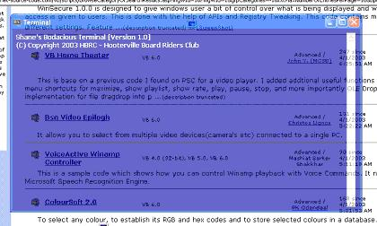



## My Terminal

### Description

This is a replacement for DOS shell, I'm still working on it. But it does all DOS commands, I just need to add some other stuff to it. This only works in win 2k or XP becuase of the transparent form.
 
### More Info
 

             |
---                |---
**Submitted On**   |2003-03-27 18:38:06
**By**             |[Shane Wallis](https://github.com/Planet-Source-Code/PSCIndex/blob/master/ByAuthor/shane-wallis.md)
**Level**          |Intermediate
**User Rating**    |5.0 (10 globes from 2 users)
**Compatibility**  |VB 6\.0
**Category**       |[Miscellaneous](https://github.com/Planet-Source-Code/PSCIndex/blob/master/ByCategory/miscellaneous__1-1.md)
**World**          |[Visual Basic](https://github.com/Planet-Source-Code/PSCIndex/blob/master/ByWorld/visual-basic.md)
**Archive File**   |[My\_Termina156786422003\.zip](https://github.com/Planet-Source-Code/shane-wallis-my-terminal__1-44427/archive/master.zip)

